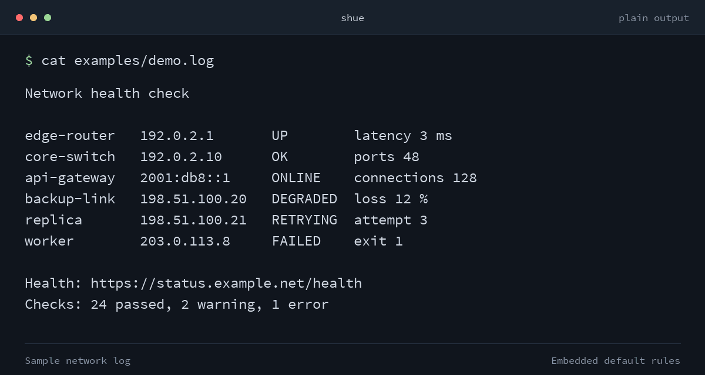

# `shue`

`shue` highlights terminal output with configurable rules. It wraps your normal
SSH client by default, runs other programs, or filters stdin. Existing terminal
colors and non-UTF-8 bytes are preserved.

```console
shue username@host
```

Inspired by [ChromaTerm2](https://github.com/rgcr/ChromaTerm2), with compatible
YAML configuration and PCRE2 regex support.



> [!NOTE]
> `shue` is almost 100% vibe-coded.

## Installation

Supports macOS and Linux on Apple Silicon/ARM64 and x86-64.

### Homebrew

```
brew install thatmattlove/tap/shue
```

### Precompiled binary

Download an archive and `SHA256SUMS` from [Releases](../../releases):

| System              | Target                       |
| ------------------- | ---------------------------- |
| Apple Silicon macOS | `aarch64-apple-darwin`       |
| Intel macOS         | `x86_64-apple-darwin`        |
| ARM64 Linux         | `aarch64-unknown-linux-musl` |
| x86-64 Linux        | `x86_64-unknown-linux-musl`  |

Verify and install the downloaded archive (example: ARM64 macOS, v0.1.0):

```bash
set -eu
VERSION=0.1.0
TARGET=aarch64-apple-darwin
ARCHIVE="shue-v${VERSION}-${TARGET}.tar.gz"
grep "  ${ARCHIVE}$" SHA256SUMS | shasum -a 256 -c -
tar -xzf "$ARCHIVE"
install -d "$HOME/.local/bin"
install -m 0755 "${ARCHIVE%.tar.gz}/shue" "$HOME/.local/bin/shue"
```

Add `$HOME/.local/bin` to `PATH`, then run `shue --version`.
For source builds, see [CONTRIBUTING.md](CONTRIBUTING.md#development).

## Usage

### SSH

Use your usual SSH arguments, with shue options first:

```bash
shue username@host
shue --color-depth truecolor -p 2222 username@host
shue -J bastion.example.net username@host show interfaces
```

The first positional or unrecognized argument ends shue option parsing;
all remaining arguments pass through unchanged. Use `--` to end parsing
explicitly. SSH configuration, agents, host aliases, and exit codes work as usual.

Shue selects the SSH client from `--ssh-path PATH`, then `SHUE_SSH`, then
`ssh` on `PATH`.

### Other programs and pipelines

Use `--exec` to wrap a program, or `--filter` to highlight stdin:

```bash
shue --exec ping -c 4 192.0.2.1
shue --config ./rules.yaml --exec tail -f /var/log/system.log
journalctl -b | shue --filter | less -R
shue --filter < session.log
```

All arguments after the `--exec` program pass through unchanged. Filter mode
keeps highlighting enabled when stdout is piped. Run `shue --help` for all options.

## Configuration

The embedded defaults highlight status words, IP addresses, URLs, and numbers.
To customize them, save a config at `$HOME/.config/shue/config.yaml` or select
one with `--config PATH`.

Configuration sources are checked in order; the first available source wins:

1. `--config PATH`
2. `SHUE_CONFIG`
3. `$XDG_CONFIG_HOME/shue/config.yaml` (defaults to `$HOME/.config/shue/config.yaml`)
4. `shue/config.yaml` in each absolute `XDG_CONFIG_DIRS` entry (default: `/etc/xdg`)
5. `/etc/shue/config.yaml`
6. embedded defaults

Each discovered directory also checks `config.yml` after `config.yaml`.
Explicit paths must exist; unreadable files and invalid UTF-8 are errors.
Invalid YAML produces a warning and an empty configuration. Invalid palette
entries, rules, or color groups are skipped with a `shue: warning:` diagnostic;
valid rules remain active.

Use top-level `palette` and `rules`, with `description`, `regex`, `color`, and
`exclusive` fields per rule:

```yaml
palette:
  accent: "#5f87ff"

rules:
  - description: request result
    regex: "status=(?<status>ok|failed)"
    color:
      status: "f.accent bold"
    exclusive: true
```

`color` accepts a style string or a map of capture groups to styles. Group `0`
styles the whole match. Exclusive rules take priority over later overlapping
rules. See [examples/config.yaml](examples/config.yaml) for more examples.

### Regex

PCRE2 byte regexes support lookahead, lookbehind, numeric and named captures,
and backreferences. Use single-quoted YAML strings for patterns with backslashes.
Available features and lookbehind limits depend on the linked PCRE2 version.
If a rule hits a runtime limit, shue disables it, warns once, and continues
with the remaining rules.

### Colors

ANSI colors follow your terminal theme:

```yaml
color: "fg:red bg:default bold"
```

Names: `black`, `red`, `green`, `yellow`, `blue`, `magenta` (or `purple`),
`cyan`, `white`, their `bright-*` variants, and `default`.

Custom colors accept `f#rrggbb`, `b#rrggbb`, `f.name`, `b.name`, `fg:#rrggbb`,
`bg:#rrggbb`, `fg:rgb(r,g,b)`, and `bg:rgb(r,g,b)`. Styles include `bold`,
`dim`, `italic`, `underline`, `blink`, `invert`, `hidden`, and `strike`.

Set `--color-depth` or `SHUE_COLOR_DEPTH` to `auto` (default), `ansi16`,
`ansi256`, or `truecolor`. Auto detection uses `COLORTERM` and `TERM`, falling
back to `ansi16`. RGB colors are converted for lower color depths.
Use `--no-color` or `NO_COLOR` to disable added highlighting.

## Limitations

- Windows/ConPTY is not supported.
- Interactive programs use a PTY, combining stdout and stderr. With redirected
  input or output, only stdout is highlighted; stderr passes through unchanged.
- Prompt flushing creates a boundary that regexes cannot match across.
- Support for styles such as blink, italic, hidden, and strike varies by terminal.

## Contributing

See [CONTRIBUTING.md](CONTRIBUTING.md) for development, verification, and releases.

## License

[](LICENSE)
